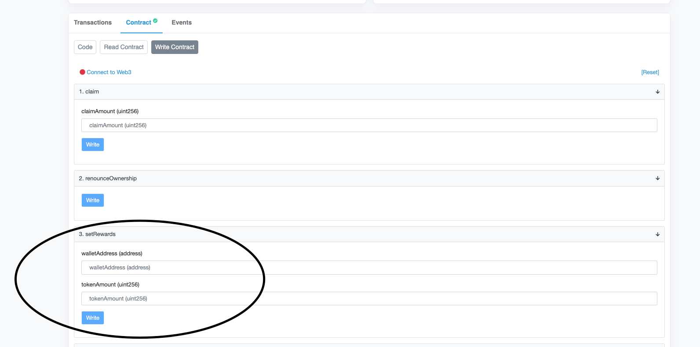

# Guide
 React Web3 Metamask connection

-Set up Environment in CLI to install node modules
 npm i

-Configure Env file
PRIVATE_KEY = your_wallet_private_key
BSCSCAN_API = your bscscan.com API key

-Deploy two smart contracts(Token contract and claim contract )
 
 TestToken
  1) edit the 9th line to this  in scripts/run.js
     const contractFactory = await hre.ethers.getContractFactory("TestToken");
  2) edit the 13th line to this in scripts/run.js
     const contract = await contractFactory.deploy();
  3) run the following commands in CLI
      
     npx hardhat clean
     
     npx hardhat run scripts/run.js
     
     after that, you will see deployed smart contract address in console.
     To verify that smart contract deployed, run the following command
     
     npx hardhat verify --network bsctestnet {deployed_contractaddress}
     
 Claim contract

1) edit the 9th line to this  in scripts/run.js
   const contractFactory = await hre.ethers.getContractFactory("claimContract");
2) edit the 13th line to this in scripts/run.js
   const contract = await contractFactory.deploy(TestTokenAddress);
3) run the following commands in CLI   
   npx hardhat clean

   npx hardhat run scripts/run.js

   after that, you will see deployed smart contract address in console.
   To verify that smart contract deployed, run the following command

   npx hardhat verify --network bsctestnet {deployed_contractaddress} {testToken address as parameter}
    

-Replace deployed claim contract address in src/constants/addresses.ts
  In the object of BSC_TESTNET,
  place claim contract address:
  
  CLAIM_ADDRESS: "Here"

-Replace ABI of claim contract in src/abi/ClaimContract.json

-Run "npm start"

-to set the list of 5 wallet addresses and claim token amounts, use setRewards function which can be available only for contract onwer.
 
 
